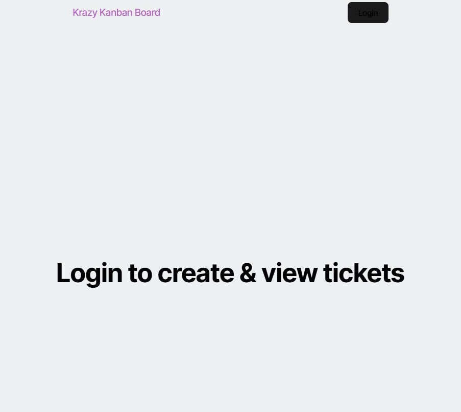

# Secure-Kanban
# Kanban Board with Secure Authentication

## Table of Contents
- [Description](#description)
- [Features](#features)
- [Technologies Used](#technologies-used)
- [Installation](#installation)
- [Usage](#usage)
- [Screenshots](#screenshots)
- [Deployment](#deployment)
- [Contact](#contact)

---

## Description
This project is a **Kanban board** application with a **secure login system** utilizing **JSON Web Tokens (JWT)** for authentication. Users must log in to access the board, and their session remains active until they log out or become inactive for a specified period. Unauthorized users are redirected to the login page, ensuring secure task management.

---

## Features

### 🔐 Secure Authentication & Session Management
- Users must enter a **valid username and password** to access the Kanban board.
- Authentication is handled using **JWT (JSON Web Tokens)**.
- If an **incorrect username or password** is entered, an **error message** is displayed.
- Upon successful login, users are redirected to the **Kanban board**.
- **JWT tokens are securely stored** in local storage for authenticated requests.
- If the user **logs out**, the JWT is removed, and they are redirected to the **login page**.
- If a user remains **inactive**, their session expires, and they are logged out automatically.
- Unauthorized access attempts redirect users to the **login page**.

### 📌 Kanban Board Functionality
- **Add, edit, and delete tasks**.
- **Drag and drop tasks** between columns (To Do, In Progress, Done).
- **Organize tasks** for improved workflow.

---

## Technologies Used
- **React.js** – Frontend framework
- **React Router** – For navigation
- **JWT (JSON Web Tokens)** – For authentication
- **Express.js & Node.js** – Backend API
- **MongoDB / PostgreSQL** – Database for storing user data and tasks
- **Tailwind CSS / Bootstrap** – Styling and UI components
- **Local Storage** – Securely storing JWT tokens client-side

---

## Installation
To run the project locally, follow these steps:

1. **Clone the Repository:**
   ```sh
   git clone https://github.com/DavidSwider/Secure-Kanban.git
   cd Secure-Kanban
   ```  
2. **Install Dependencies:**
   ```sh
   npm install
   ```  
3. **Start the Backend Server:**
   ```sh
   npm run server
   ```  
4. **Start the Frontend:**
   ```sh
   npm start
   ```  
5. Open `http://localhost:3000/` in your browser.

---

## Usage

1. **Log in** with a **valid username and password**.
2. If credentials are incorrect, an **error message** will appear.
3. Once logged in, access the **Kanban board** to manage tasks.
4. Drag and drop tasks between different categories.
5. **Log out** to remove JWT and secure your session.
6. If inactive for too long, the session will expire, requiring re-authentication.

---

## Screenshots
📸 **

---

## Deployment
The application is deployed at:
🔗 **[Live Application](https://secure-kanban-cz3n.onrender.com)**

---

## Contact
📧 Email: davidswider6@gmail.com  
🔗 GitHub: [YourGitHubProfile](https://github.com/DavidSwider/Secure-Kanban)  
  

---

This README provides a structured overview of your Kanban board project. Let me know if you need any modifications! 🚀

